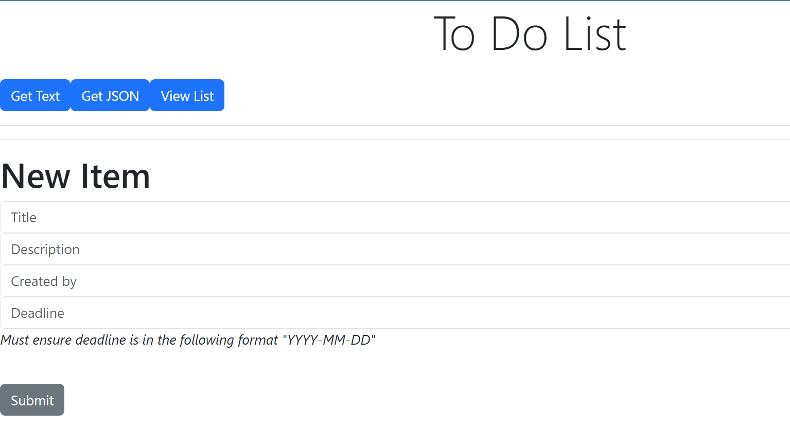

# To Do List Web Application
## First Version

## Improved Version

The purpose of this project is to develop a clear understanding of how web applications work in whole, with the independence of technology, frameworks and hosting used. The first version is intended to be a basic app. The improved version will implement feedback provided by colleagues at SAP. 

## Table of Contents
  - [Description](#description)
  - [Installation](#installation)
  - [Usage](#usage)
  - [API Documentation](#api-documentation)
  - [Technologies Used](#technologies-used)
  - [Features](#features)
  - [Useful Links](#useful-links)

## Description

To develop the application, you are required to:
1. Create a table called TODO_ITEMS, within the todo database via SQL statements (READ, INSERT, EDIT, DELETE).
2. Develop a server that exposes API endpoints to READ, INSERT, EDIT and DELETE items in TODO_ITEMS table.
3. Using a browser and Postman, do HTTP requests to the API endpoints. Inspect HTTP trace.
4. Create a front-end, which runs independently with static data and later retrieves data from database using API endpoints.
5. Receive feedback from peers/colleagues/mentors etc., to improve upon the first version of your application

## Installation
*Mandatory:*
- SQLite
- Postman

*Optional:*
- DB Browser for SQLite

## Usage

Guide on how to use your project, including how to run the application and any command-line options or environment variables.

## API Documentation

If your project has an API, provide documentation for endpoints and their usage.

## Technologies Used

List of the main technologies, programming languages, libraries, and frameworks used in your project.

## Features
Highlight the key features of your project.

## Useful Links
- [SQLite Tutorial for Beginners in 1 Hour](https://www.youtube.com/watch?v=GMHK-0TKRVk)
- [Lets Build a Node Rest API](https://www.youtube.com/watch?v=cr3pX6fSUpc)
- [Fetch API Introduction](https://www.youtube.com/watch?v=Oive66jrwBs)

